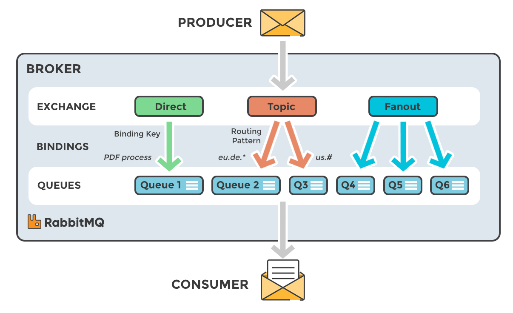

Reference: https://www.javainuse.com/spring/spring-boot-rabbitmq-hello-world  
           https://youtu.be/deG25y_r6OY?list=PLr0RDWYdEAMwIS8KpQowAL6vgiCwBgVwH

<b>To set up on localhost:</b>
1) Install Erlang because RabbitMQ was built using Eralng, it is required.
2) Install RabbitMQ and open port 15672(default port) to allow incoming HTTP requests (TCP connection).
3) Enable RabbitMQ Management console using "rabbitmq-plugins.bat enable rabbitmq_management" from bin folder.

Then setup exchange, queues and bindings using RabbitMQ Management console from configuration in application.properties file.
1) Create Exchange
2) Create Queue
3) Define binding with binding key to connect that exachange with Queue.

<b>Theory:</b>

In RabbitMQ, the message is not sent to queue directly. Instead it is pushed to Exchange and exchange pushes messages to respective Queues.
Every Queue is connected to Exchange using binding key. While pushing we should give actual message + routingKey, then exchange compares the
routing key with all binding keys of all queues and pushes the message to the queue for which routingkey = bindingkey. Then Listener must
be connected to individual queues, when the message is present on queue, the listener observes it and does its processing.

<b>With RabbitMQ there are 4 types of Exchanges:</b>
1) Direct Exchange (Send messages to Queues with routing key = binding key) -- Mostly used.
2) Fanout Exchange (Sends to all Queues connected to that exchange)
3) Topic Exchange (Sends to all Queues matching patterns * and #)
4) Header Exchange (Using message header. No complete idea.)

